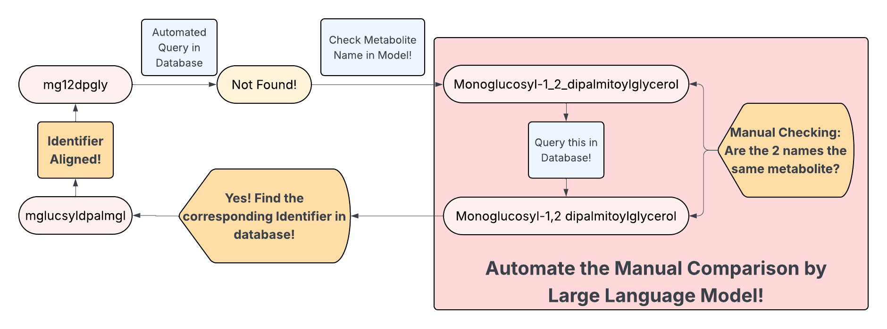
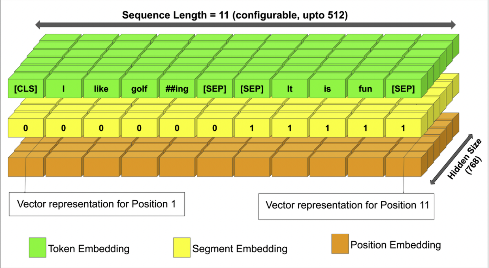
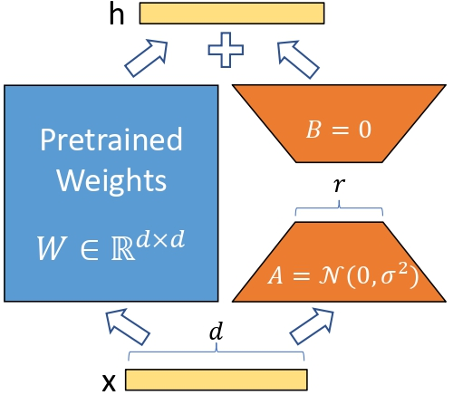
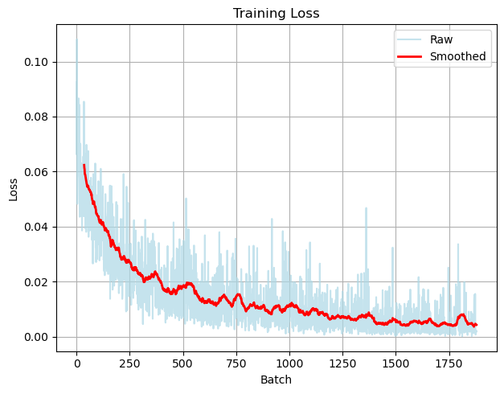

# MetaAlignGen: Fine-tuned Generative Model for Metabolite Identifier Alignment

This is the final Project for ECE 175B/ECE 285 - Probabilistic Reasoning and Graphical Models at UC San Diego.

## Problem Statement

Genome-scale metabolic models (GEMs) require unique metabolite identifiers for accurate simulation. However, model reconstruction often involves transferring information from multiple template models, resulting in identifier mismatches for the same metabolite. Manual curation of these mismatches is time-consuming and can take days for a typical model with 2000+ metabolites. Existing rule-based approaches fail when metabolite identifiers are not in existing databases, and broad-domain models like ChatGPT-4o lack the specialized biochemical knowledge needed for accurate metabolite name alignment.




## Solution

MetaAlignGen automates metabolite identifier alignment by fine-tuning BioMegatron 345m with contrastive learning on metabolic nomenclature. The approach uses LoRA (Low-Rank Adaptation) for efficient training with limited GPU resources and employs semantic understanding to recognize biochemical equivalence across naming variations. This enables the model to distinguish between genuine nomenclature differences (e.g., "glucose-6-phosphate" vs "glucose 6 phosphate") and actual chemical distinctions.

## Methodology

The model architecture is built on BioMegatron 345m Uncased, a transformer-based language model pretrained on biomedical literature. Fine-tuning is performed using LoRA (Low-Rank Adaptation) with rank r=16 and scaling factor α=32, targeting the query, key, value, and dense layers in the attention mechanism. The training approach employs contrastive learning with a margin-based loss function, teaching the model to pull similar metabolite pairs together in embedding space while pushing dissimilar pairs apart.







### Training Configuration

| Hyperparameter | Value |
|----------------|-------|
| Epochs | 10 |
| Batch Size | 16 |
| Learning Rate | 2 × 10⁻⁴ |
| LoRA Rank (r) | 16 |
| LoRA Alpha (α) | 32 |
| Contrastive Loss Margin | 0.5 |
| Optimizer | AdamW |

### Training Dataset

The training dataset consists of 3,000 metabolite pairs generated from the BiGG Models database, balanced equally between 1,500 positive and 1,500 negative cases. Positive pairs are created by modifying original metabolite names with randomly substituted delimiters (-, _, space, comma, parentheses), simulating real-world nomenclature variations. Negative pairs undergo the same delimiter modifications but additionally have one random functional group removed, creating chemically distinct compounds. This augmentation strategy ensures the model learns to recognize biochemical nomenclature patterns rather than simply memorizing name pairs.

## Results

### Training Performance
- **Dataset Size:** 3,000 pairs
- **Training Epochs:** 10
- **Initial Loss:** 0.0924
- **Final Loss:** 0.0019
- **Improvement:** 98.0%




### Testing Performance

**Test Dataset:** 135 metabolites from *Staphylococcus aureus* GEM with manual ground truth alignment

#### Base Model (BioMegatron without fine-tuning)
- **Accuracy:** 50.4% (68/135 correct)
- **False Positives:** 62 metabolites
- **False Negatives:** 5 metabolites
- **Total Errors:** 67 metabolites

#### Fine-tuned Model (MetaAlignGen)
- **Accuracy:** 75.6% (102/135 correct)
- **False Positives:** 24 metabolites
- **False Negatives:** 9 metabolites
- **Total Errors:** 33 metabolites

#### Improvement Summary
- **Accuracy Gain:** +25.2 percentage points (50.4% → 75.6%)
- **False Positive Reduction:** 38 metabolites (61% reduction: 62 → 24)
- **Error Reduction:** 34 metabolites (51% reduction: 67 → 33)

### Key Success Examples

**Example 1: Corrected False Positive**

The fine-tuned model successfully distinguished between "CDP-1_2-dianteisopentadecanoylglycerol" and "CDP-1,2-dioctadecanoylglycerol", which the base model incorrectly matched with a similarity score of 0.984 (above the 0.94 threshold). Despite sharing similar CDP-diacylglycerol backbone structures, these metabolites are chemically distinct due to different fatty acid chains (anteisopentadecanoyl with 15 carbons vs. octadecanoyl with 18 carbons). The fine-tuned model correctly scored them at 0.885, below the threshold, demonstrating its ability to recognize subtle but biochemically significant structural differences.

**Example 2: Corrected False Positive - Chain Length Distinction**

The base model incorrectly matched "Dianteisopentadecanoylphosphatidylethanolamine" with "Dianteisoheptadecanoylphosphatidylethanolamine" (score: 0.988), despite these being distinct compounds with different chain lengths (15-carbon vs. 17-carbon fatty acids). The fine-tuned model correctly identified them as different (score: 0.937, below threshold), showing improved understanding of numerical prefixes in chemical nomenclature.


## Advantages and Limitations

MetaAlignGen offers several key advantages: it reduces days of manual curation work through automation, employs semantic understanding to recognize biochemical equivalence beyond simple string matching, and leverages domain-specific fine-tuning on metabolic nomenclature that general LLMs lack. The LoRA approach enables efficient training with limited GPU resources while achieving 75.6% accuracy with significant false positive reduction. However, the model's 345M parameter size may limit its ability to capture the full complexity of chemical nomenclature, and it cannot fully replace human expert insight for highly ambiguous cases. Additionally, performance is inherently limited by the coverage of the BiGG database used for candidate matching.

## Citation

```
@software{metaalignen2024,
  author = {Yige Gong},
  title = {MetaAlignGen: Fine-tuned Generative Model for Metabolite Identifier Alignment},
  year = {2024},
  url = {https://github.com/yourusername/MetaAlignGen}
}
```

## References

1. Gu, C., Kim, G.B., Kim, W.J. et al. (2019). Current status and applications of genome-scale metabolic models. *Genome Biology*, 20(121).

2. Hu, E. J., et al. (2021). LoRA: Low-Rank Adaptation of Large Language Models. *arXiv:2106.09685*.

3. NVIDIA (2021). BioMegatron 345m Uncased. NVIDIA NGC Catalog.

4. King, Z. A., et al. (2016). BiGG Models: A platform for integrating, standardizing and sharing genome-scale models. *Nucleic Acids Research*, 44(D1), D515-D522.

5. Kingma, D. P., & Ba, J. (2014). Adam: A method for stochastic optimization. *arXiv:1412.6980*.


